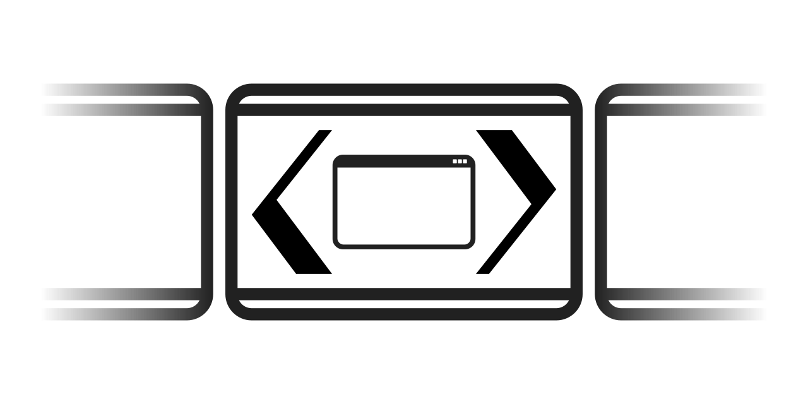

.. _Authors: ./AUTHORS.rst
.. _Licence: ./LICENSE.txt
.. _Changelog: ./CHANGELOG.rst

.. EndOfLinks

======================================
EWMH Compliant Move To Monitor utility
======================================

|logo|

📜 `Licence`_ − 👥 `Authors`_ − 📝 `Changelog`_

|version_badge| |test_badge| |doc_badge|

.. |doc_badge| image:: https://readthedocs.org/projects/ewmh-m2m/badge/?version=latest
   :target: https://ewmh-m2m.readthedocs.io/en/latest/?badge=latest
   :alt: Documentation Status

.. |test_badge| image:: https://github.com/AlexisBRENON/ewmh_m2m/workflows/Python/badge.svg
   :target: https://github.com/AlexisBRENON/ewmh_m2m/actions?query=workflow%3APython+branch%3Amaster
   :alt: Test Status

.. |version_badge| image:: https://img.shields.io/pypi/v/ewmh_m2m?label=Version
   :target: https://pypi.org/project/ewmh-m2m/
   :alt: GitHub tag (latest SemVer)

Rationale
=========

I love XFCE. I use it on almost all my computers.
However, in a multi head setup, it lacks a "move window to monitor" feature.
Some posts link to the `move-to-next-monitor`_ script, which as many dependencies and is not very customizable
(move to bottom, to right, etc.)

Hence, here it is ewmh_m2m.

Install
=======

Just install the package with pip::

    pip install ewmh-m2m  # Note the dash and not the underscore!

You should now have a ``move-to-monitor`` command available.

Usage
=====

You should bind the ``move-to-monitor`` command to your desired keyboard shortcut.
This command also accepts some arguments to control where the window is moved.
Type ``move-to-monitor --help`` in a terminal for the list of accepted options.

Development
===========

Feel free to ask some features on `GitHub`_.
You can also develop your own features and open Pull Requests.
Take a look at the `technical documentation`_.

.. _GitHub: https://github.com/AlexisBRENON/ewmh_m2m
.. _technical documentation: https://ewmh-m2m.readthedocs.io/

.. _move-to-next-monitor: https://github.com/jc00ke/move-to-next-monitor
